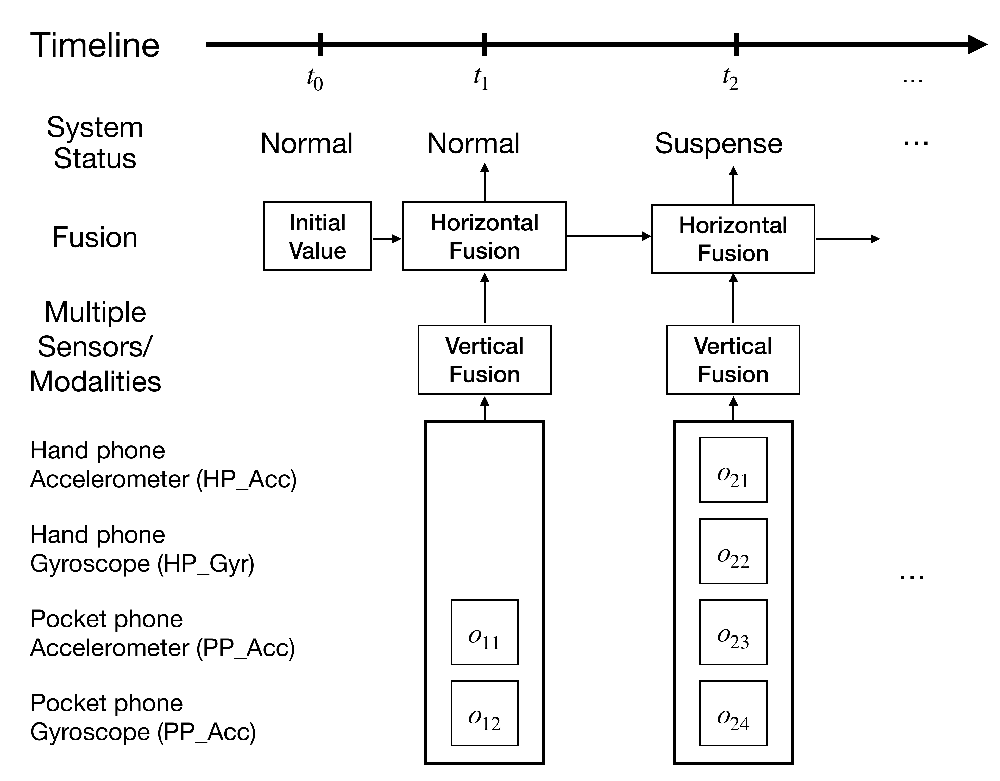

# SSPRA: State-Space Perturbation-Resistant Approach

Official code repository for **SSPRA (State-Space Perturbation-Resistant Approach)**, the continuous authentication framework introduced in:

> Frank Chen, Jingyu Xin, and Vir V. Phoha, "SSPRA: A Robust Approach to Continuous Authentication Amidst Real-World Adversarial Challenges," IEEE Transactions on Biometrics, Behavior, and Identity Science, 2024. DOI: [10.1109/TBIOM.2024.3369590](https://doi.org/10.1109/TBIOM.2024.3369590)

## Overview

Continuous authentication systems must make reliable decisions over time while operating under realistic deployment conditions, including noisy sensor measurements, temporary modality disconnection, missing observations, and adversarial behavior. Existing continuous authentication models often treat each authentication window independently, which can make the system sensitive to transient perturbations and unstable evidence from individual modalities.

[](assets/figures/Figure-1.pdf)

SSPRA addresses these challenges with a state-space temporal monitoring framework. At each inspection time, SSPRA fuses authentication evidence from all currently available modalities, allowing the system to continue monitoring when some modalities are temporarily absent or unreliable. Instead of making each decision from the current authentication scores alone, SSPRA also incorporates the previous system state and the elapsed time between inspections, capturing the temporal continuity of behavioral biometric evidence. The framework updates the probabilities of three system states: **Safe**, **Suspense**, and **Attacked**. It is modality-agnostic and can operate on any modality that provides intra-user and inter-user likelihood evidence. 

In this repository, we provide a runnable BB-MAS Stage 2 gait demo using HandPhone and PocketPhone accelerometer/gyroscope streams.

## Repository Layout

```text
assets/stage2/       Stage 2 gait model checkpoints, templates, and PMFs for user 1
data/                Local data workspace
experiments/         Demo configuration
scripts/             Scripts to prepare data, run SSPRA, and evaluate
src/sspra/           Core SSPRA implementation
```

## Data Availability

The SU-AIS BB-MAS dataset used in the paper is not redistributed in this repository because it is hosted externally by IEEE DataPort. This repository provides the SSPRA implementation, configuration files, precomputed demo assets, and scripts for preparing and running the Stage 2 gait demo after the user downloads the dataset.

## Setup

Use Python 3.11 for the repo.

```bash
git clone https://github.com/DrFrankSChen/SSPRA-State-Space-Perturbation-Resistant-Approach.git
cd SSPRA-State-Space-Perturbation-Resistant-Approach

python3.11 -m venv .venv
source .venv/bin/activate
python --version  # should print Python 3.11.x
python -m pip install --upgrade pip
python -m pip install -r requirements.txt
```

## Get BB-MAS

Download `BB-MAS_Dataset.zip` from IEEE DataPort:

[https://ieee-dataport.org/open-access/su-ais-bb-mas-syracuse-university-and-assured-information-security-behavioral](https://ieee-dataport.org/open-access/su-ais-bb-mas-syracuse-university-and-assured-information-security-behavioral)

Unzip it under `data/`:

```bash
mkdir -p data
unzip /path/to/BB-MAS_Dataset.zip -d data
```

The expected layout is:

```text
data/BB-MAS_Dataset/1/
data/BB-MAS_Dataset/2/
...
```

The preparation script also accepts the nested layout produced by some unzip tools:

```text
data/BB-MAS_Dataset/BB-MAS_Dataset/1/
```


## Run the Demo

```bash
python scripts/prepare_demo_data.py
python scripts/run_stage2_demo.py
python scripts/evaluate_demo.py
```

`prepare_demo_data.py` creates three 45-second Stage 2 demo streams for the paper's Figure 4 test settings:

- Test 1 uses user 1 as the genuine user. It contains user 1's Stage 2 Walk2 stream with all four gait modalities unchanged.
- Test 2 simulates a non-zero-effort (NZE) attack from user 2 on all four modalities. It uses user 1's Stage 2 Walk2 stream until row 999, then substitutes all 12 Stage 2 columns with user 2's Stage 2 Walk2 data starting at row 1000. At 100 Hz, row 1000 is 10 seconds.
- Test 3 simulates temporary modality disconnection. It uses user 1's Stage 2 Walk2 stream, but zero-fills the PocketPhone gyroscope columns from row 1000 to row 1499. At 100 Hz, this represents a 5-second `PP_Gyr` disconnection from 10 seconds to 15 seconds.

`run_stage2_demo.py` runs SSPRA on each prepared stream. Probability and state traces are written under `outputs/demo/`.

`evaluate_demo.py` writes `outputs/demo/metrics.json` using the temporal metrics proposed in the paper:

- Test 1: `FAR` and `RRT`.
- Test 2: `FAR`, `TAR`, `TCA`, and `FPaR`.
- Test 3: `FARDD` and `TPaR`.

Rate metrics are reported as 0 or 1 for each demo trace because the demo runs one trace per test. Time metrics are reported in seconds.

## Demo Outputs

Running the demo creates the following outputs:

```text
outputs/demo/test1/       Genuine-user monitoring trace
outputs/demo/test2/       Simulated non-zero-effort attack trace
outputs/demo/test3/       Simulated temporary modality-disconnection trace
outputs/demo/metrics.json Temporal monitoring metrics for the three demo traces
```

Each test directory contains probability and state traces generated by SSPRA. These traces can be used to inspect how the Safe/Suspense/Attacked state probabilities evolve over time under genuine-use, attack, and modality-disconnection scenarios.

## Using SSPRA With Other Data

For non-gait modalities, prepare likelihood observations and call `SSPRAMonitor.run_sspra_inference(...)` from `src/sspra/monitoring.py`. Each observation batch should provide an inspection time, elapsed time, and per-modality `intra` and `inter` likelihoods derived from modality-specific PMFs. The monitor is independent of BB-MAS once those likelihoods are available.

Minimal example:

```python
from sspra.fusion import ObservationBatch
from sspra.monitoring import SSPRAMonitor

monitor = SSPRAMonitor()

# time and delta are sample counts. With the default 100 Hz setting,
# time=100 and delta=100 correspond to 1 second.
batches = [
    ObservationBatch(
        time=100,
        delta=100,
        observations=[
            {"modality": "sensor_a", "intra": 0.85, "inter": 0.15},
            {"modality": "sensor_b", "intra": 0.70, "inter": 0.30},
        ],
    )
]

result = monitor.run_sspra_inference(batches)

print(result.states)
print(result.probabilities)
```

## Citation

Please cite our paper if you use SSPRA or its components in your research:

```bibtex
@article{chen2024sspra,
  title={Sspra: A robust approach to continuous authentication amidst real-world adversarial challenges},
  author={Chen, Frank and Xin, Jingyu and Phoha, Vir V},
  journal={IEEE Transactions on Biometrics, Behavior, and Identity Science},
  volume={6},
  number={2},
  pages={245--260},
  year={2024},
  publisher={IEEE}
}
```
